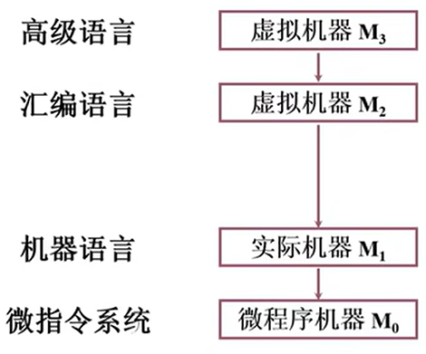
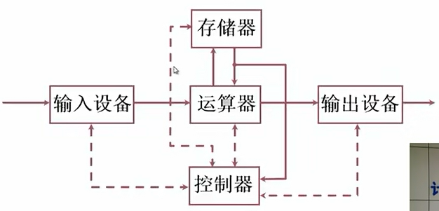
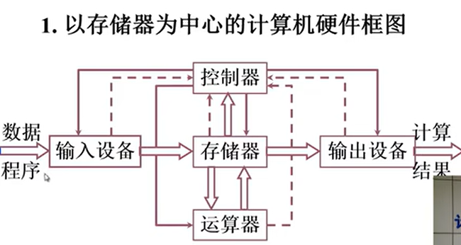
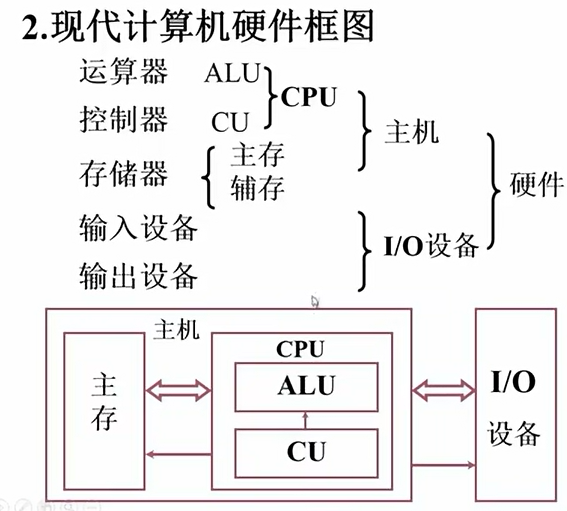

# 第一章——计算机系统概论
## 1.1 计算机系统简介
### 计算机的软硬件概念 
硬件：计算机的实体，如主机、外设等  
软件：由具有各类特殊功能的信息（程序）组成。分为以下两种：
+ 系统软件：用来管理整个计算机系统。如语言处理程序、操作系统、服务性程序、数据库管理系统和网络软件等
+ 应用软件：按任务需要编制成的各种程序  

### 计算机系统的层次结构

### 计算机体系结构和计算机组成
计算机体系结构：程序员所见到的计算机系统的属性概念性的结构与功能特性（指令系统、数据类型、寻址技术、I/O机理）  
计算机组成：实现计算机体系结构所体现的属性（具体指令的实现）  

## 1.2 计算机的基本组成  
### 冯.诺依曼计算机的特点  
1.计算机由五大部件组成  
2.指令和数据以同等地位存于存储器，可按地址寻访  
3.指令和数据用二进制表示  
4.指令由操作码和地址码组成  
5.存储程序（核心特征）  
6.以运算器为中心  

### 冯.诺依曼计算机硬件框图  

+ 运算器完成算数运算和逻辑运算  
+ 存储器存放数据和程序  
+ 控制器指挥控制程序的执行
+ 输入设备将信息转换为机器能识别的形式  
+ 输出设备将结果转换为人们熟悉的形式  
实线为数据通路，数据通过这些线进行流动  
虚线表示控制和状态反馈

此结构缺点为：  
1.运算器为整个结构的中心，非常繁忙，会成为计算机系统的瓶颈  
2.图比较乱，不具有层次化的特征

### 改进  
1.将运算器为中心改进成以存储器为中心，实现I/O设备与存储器之间直接的信息交换  

2.现代计算机硬件框图：  

### 系统复杂性管理的方法（3’Y）
+ 层次化(Hierachy)：将被设计的系统划分为多个模块或子模块  
+ 模块化(Modularity)：有明确定义(well-defined)的功能和接口  
+ 规则性(regularity)：模块更容易被重用
